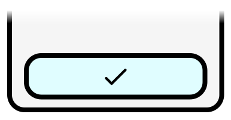
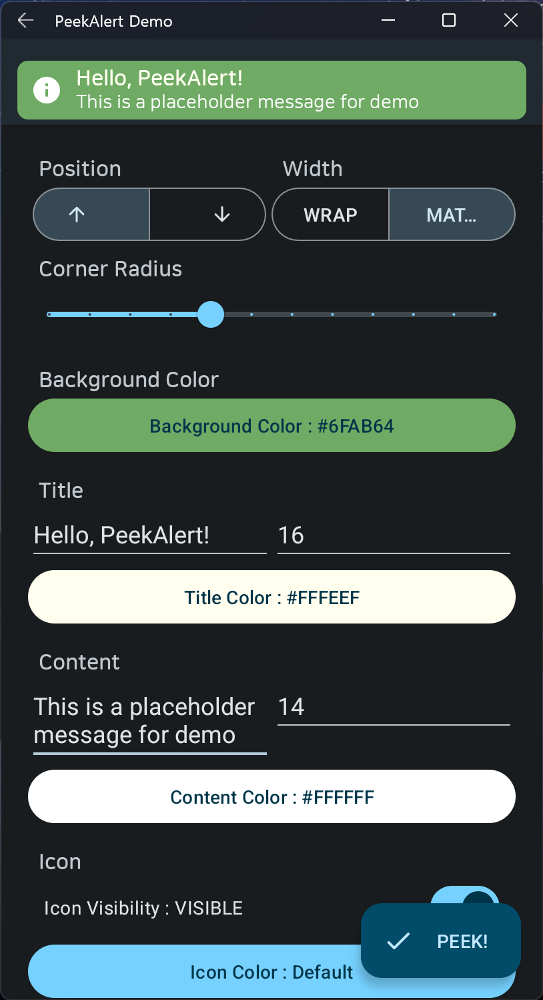
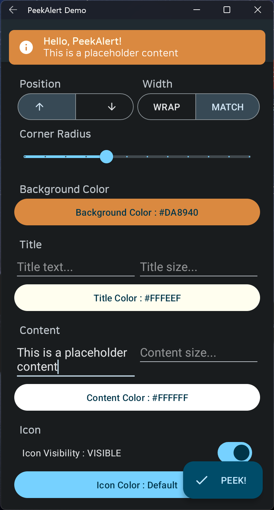
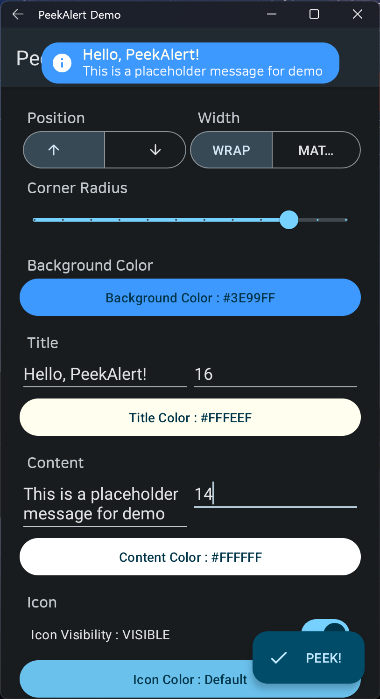

# <h1 align="center"><br>PeekAlert</h1>

<p align="center">
A Lightweight and Highly-customizable alert library
</p>

<p align="center">
    <a href="https://developer.android.com"></a>
    <a href="https://kotlinlang.org/"></a>
    <a href="./"></a>
    <a href="./LICENSE"></a>
</p>

<p align="center">
PeekAlert can be used on both Java and Kotlin.<br>
See the examples below for more info.
</p>

<p align="center">
    ✔ Any PRs are welcome!
</p>

### Demo
<p align="center">
    
    
    
</p>

### Installation (Gradle)
+ Add jitpack url

Kotlin DSL:
```kotlin
repositories {
    /* ... */
    maven(url = "https://jitpack.io")
}
```

Groovy DSL:
```groovy
repositories {
    /* ... */
    maven { url 'https://jitpack.io' }
}
```

+ Add PeekAlert dependency  
[](https://jitpack.io/#mooner1022/PeekAlert)
```kotlin
dependencies {
    implementation("com.github.mooner1022:PeekAlert:<VERSION>")
}
```

### Usage
#### Basic usages

Java
```java
PeekAlert peekAlert = PeekAlert.create(this)
                .setDraggable(true)
                .setTitle("Hello, PeekAlert!")
                .setText("Lorem ipsum dolor sit amet, consectetur adipiscing elit.");

peekAlert.peek();
```
Kotlin
```kotlin
val peekAlert = PeekAlert.create(this)
            .setDraggable(true)
            .setTitle("Hello, PeekAlert!")
            .setText("Lorem ipsum dolor sit amet, consectetur adipiscing elit.")

peekAlert.peek()
```

Builder for kotlin is also available:
```kotlin
createPeekAlert(this) {
    draggable = true
    title("Hello, PeekAlert Builder!") {
        textColor(res = R.color.black)
    }
    text("Lorem ipsum dolor sit amet, consectetur adipiscing elit.") {
        textSize = 14f
    }
}.peek()
```

Custom
```kotlin
To be documented...
```

### Get more info at docs
[Dokka Docs](https://profile.mooner.dev/PeekAlert)